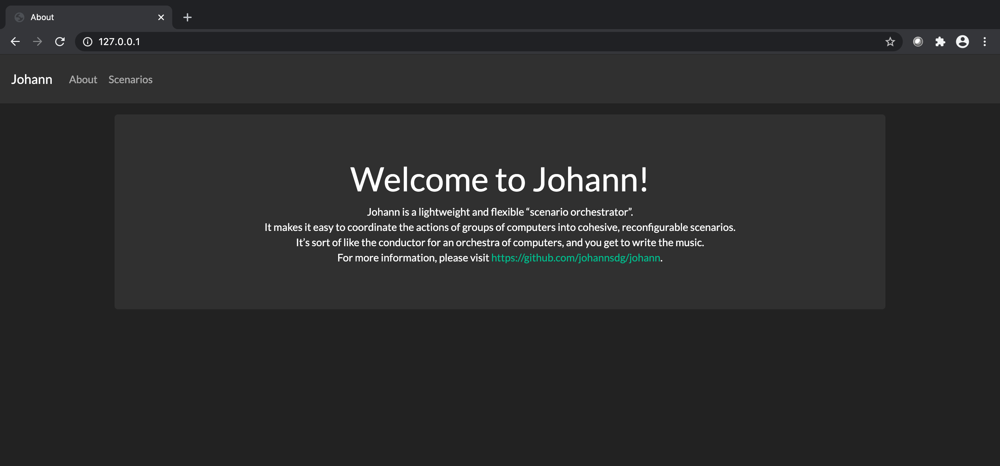
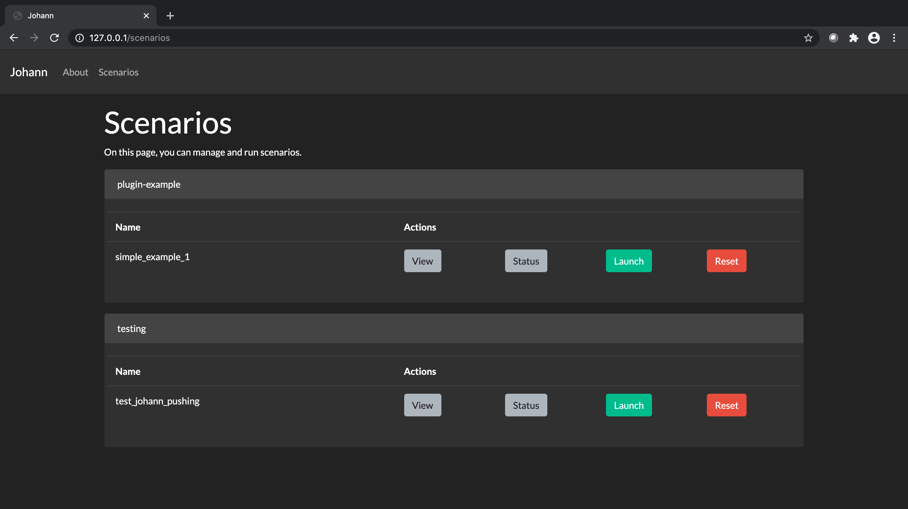
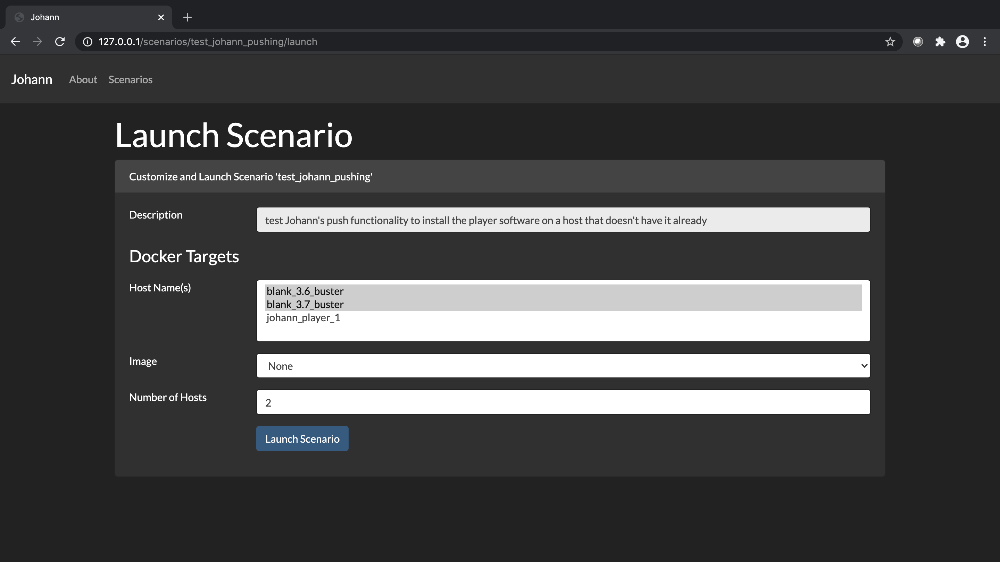
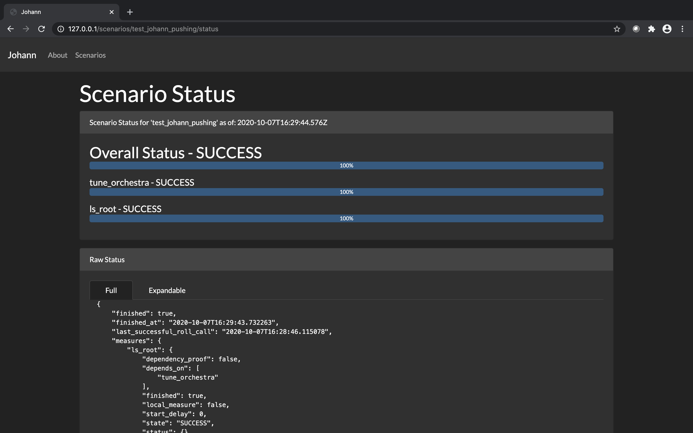

# Johann

## Summary

Johann is a lightweight and flexible “scenario orchestrator”. It makes it easy to
coordinate the actions of groups of computers into cohesive, reconfigurable scenarios.
It’s sort of like the conductor for an orchestra of computers, and _you_ get to write
the music.

## Getting Started

First clone the [Johann Repo](https://github.com/johannsdg/johann) and change directories into the newly cloned repo. 

### Installing
Johann is designed to be used on Linux and run in a docker container. It has been tested on Ubuntu 18.04, and likely
works on several other distributions as well.

Johann requires the following to run:

- [Docker Engine](https://docs.docker.com/engine/install/#server)
- [Docker Compose](https://docs.docker.com/compose/install/)
- Make

Here is an example of how to install these on Ubuntu/Debian:

```bash
# Install make
sudo apt-get update
sudo apt-get install build-essential

# Install docker via convenience script (not for production environments)
curl https://get.docker.com | sudo sh
sudo usermod -aG docker $USER
# log out and log back in
docker run hello-world

# Install docker-compose
sudo curl -L "https://github.com/docker/compose/releases/download/1.26.2/docker-compose-$(uname -s)-$(uname -m)" -o /usr/local/bin/docker-compose
sudo chmod +x /usr/local/bin/docker-compose
docker-compose --version
```
### Running

Johann uses make to handle building and deploying its docker image. This can take a while the first time.

```bash
make dev
```


## Usage

Johann runs scenarios through score files. Similar to musical score, the file contains all
of the instructions the players should perform and the order to perform them. Each task in the scenario
is referred to as a measure, again similar to musical score, the score file links these measures together
to orchestrate the players in the full scenario. Each player is currently a separate docker container.
In the future, these could be VMs or other hosts as well.

### Lexicon

* Score -> Scenario/script of Players performing Measures in order
* Player -> Machine/Docker container that runs Measures
* Measure -> Collection of specific group of actions in a Score
* Task -> Specific action/single unit of action in a Measure


### Example Score
The following is an example score where there are 2 players which are both docker
targets. One has python 3.6 and the other has python 3.7 installed. They are identified
as `blank_3.6_buster` and `blank_3.6_buster`. These names need to match the docker containers
being used, but the names you pick for your docker containers can be arbitrary. In this case
there is only one measure with one task, to run the `ls -la` command in the root directory
of the container.


``` ymal
# Copyright (c) 2019-present, The Johann Authors. All Rights Reserved.
# Use of this source code is governed by a BSD-3-clause license that can
# be found in the LICENSE file. See the AUTHORS file for names of contributors.

---
name: test_johann_pushing
category: testing
description:
  test Johann's push functionality to install the player software on a host that doesn't
  have it already
players:
  docker_targets:
    name: docker_targets
    hosts:
      - blank_3.6_buster
      - blank_3.7_buster
    image: None
    scale: 2
measures:
  - name: ls_root
    players: [docker_targets]
    start_delay: 0
    task: johann.tasks_main.run_shell_command
    args:
      - "ls -la /"

```
* The name `ls_root` is the arbitrary name of the measure and can be used to identify it.
* The players specify which players from prior specified players should perform this measure.
* The task `johann.tasks_main.run_shell_command` specifies a specific compatible action from
  the Johann tasks. See [Johann's Task Code](https://github.com/johannsdg/johann/blob/master/johann/tasks_main.py)
   for a full list of compatible tasks where tasks functions have the header `@celery_app.task`.
   The argument `ls -la` is supplied to the Johann task in this case to specify the command to be run as a shell command. 

### Running a score

With the Johann docker container running via `make dev` users can interact with scores via either the command link or a web GUI. 

#### GUI 
* Open a web browser and navigate to `http://127.0.0.1/`



* Click on the **Scenarios** tab to view available scores

* In the given Score entry one wants to run, select one of the following options:
    * View: Displays the YAML and JSON representations of the Score file
    * Status: Displays the status of the current or last run depending on if a run in is progress
    * Launch: Runs the score file
    * Reset: Resets the run to allow for a new run to be launched and monitored with status



* To run a Score select launch to be presented with the **Launch Scenario** screen. From this menu one can select the Players (in this case Docker Machine Targets) to run the Score file. 



* Press the **Launch Scenario** button to launch the score on the selected players. 

* This will automatically take you to the status page for the score you just launched where you can watch the score perform. 
**Note**: Some scores, including the test score, may take a few minutes to initialize before running. 



#### Command Line 
* To view available scores
``` sh 
curl http://127.0.0.1:5000/scores/
```
* To run a specific score
``` sh
curl http://127.0.0.1:5000/affrettando/<score_name>
```
* To view the current status of a running score
``` sh 
watch 'curl http://127.0.0.1:5000/scores/<score_name>/status_short'
```

## Roadmap

Here are some planned improvements to Johann, in no particular order:

- add a simple GUI
- switch to [pydantic](https://github.com/samuelcolvin/pydantic)
- switch to [fastapi](https://github.com/tiangolo/fastapi)
- add more documentation
- use [mypy](https://github.com/python/mypy) and
  [pylint](https://github.com/pycqa/pylint)
- add more tests
- add user authentication
- support kwargs in Measures
- Score-level variables; configurable at runtime
