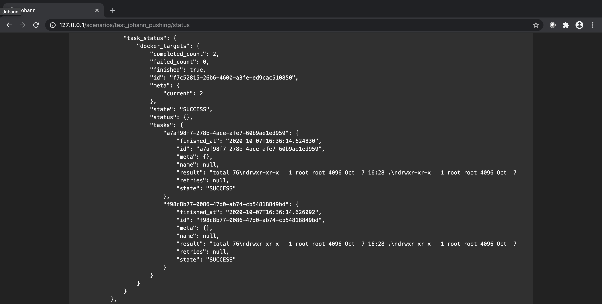

# Johann

Johann is a lightweight and flexible “scenario orchestrator”. It makes it easy to
coordinate the actions of groups of computers into cohesive, reconfigurable scenarios.
It’s sort of like the conductor for an orchestra of computers, and _you_ get to write
the music.

## Getting Started

First use git to clone [Johann](https://github.com/johannsdg/johann) and change
directories into the newly cloned repo.

### Installing

Johann is designed to be used on Linux and run in docker containers. It has been tested
on Ubuntu 18.04, and likely works on several other distributions as well.

Johann requires the following to run:

- [Docker Engine](https://docs.docker.com/engine/install/#server)
- [Docker Compose](https://docs.docker.com/compose/install/)
- Make

Here is an example of how to install these on Ubuntu/Debian:

```bash
# Install make
sudo apt-get update
sudo apt-get install build-essential

# Install docker via convenience script (not for production environments)
curl https://get.docker.com | sudo sh
sudo usermod -aG docker $USER
# log out and log back in
docker run hello-world

# Install docker-compose
sudo curl -L "https://github.com/docker/compose/releases/download/1.26.2/docker-compose-$(uname -s)-$(uname -m)" -o /usr/local/bin/docker-compose
sudo chmod +x /usr/local/bin/docker-compose
docker-compose --version
```

### Running

Johann uses make to handle building and deploying its docker image. This can take a
while the first time.

```bash
make dev
```

## Usage

Johann orchestrates scenarios through reconfigurable YAML files called "Scores". Similar
to musical scores, these files describe the the actions that the "Players" must take to
perform their part/role in the scenario. Each Player's part in the scenario consists of
"Measures" -- specific tasks and timing that Players must perform. Again similar to
musical scores, the score file weaves these Measures together to orchestrate the Players
in the full scenario. Each Player is currently comprised of a group of Docker
container(s). In the future, these could be VMs or physical machines as well.

### Lexicon

- Score -> Scenario/script describing the actions that Players must take and when
- Player -> Group of Docker container(s) that play the same part/role in the scenario
- Host -> An actual compute resource such as a Docker container, VM, or physical
  machine.
- Measure -> Maps a Task and its timing/configuration to Player(s) in a Score
- Task -> Specific action taken by Player(s) as part of a Measure

### Example Score

The following is an example Score consisting of one Player ("docker_targets") with two
Hosts which are both Docker containers (`blank_3.6_buster` and `blank_3.7_buster`). Note
that the specific Hosts need not be specified in the Score file, and can be provided (or
changed) at runtime either via API or GUI. Both of these specific Hosts are stock Debian
containers with Python installed -- versions 3.6 and 3.7, respectively Neither of these
containers have Johann installed -- it will installed or updated ("pushed") at runtime
to match the version of Johann installed on the machine running Docker. This example
Score has just one Measure executed by one Player (2 Hosts), with a Task to run the
`ls -la` command in the root directory of each Host/container.

```yaml
# Copyright (c) 2019-present, The Johann Authors. All Rights Reserved.
# Use of this source code is governed by a BSD-3-clause license that can
# be found in the LICENSE file. See the AUTHORS file for names of contributors.

---
name: test_johann_pushing
category: testing
description:
  test Johann's push functionality to install the player software on a host that doesn't
  have it already
players:
  docker_targets:
    name: docker_targets
    hosts:
      - blank_3.6_buster
      - blank_3.7_buster
    image: None
    scale: 2
measures:
  - name: ls_root
    players: [docker_targets]
    start_delay: 0
    task: johann.tasks_main.run_shell_command
    args:
      - "ls -la /"
```

- The name `ls_root` is the arbitrary name of the Measure and is used as a key in the
  API to interact with the Measure.
- The `players` key specifies which Players from the list defined above should perform
  this particular Measure.
- The Task `johann.tasks_main.run_shell_command` specifies a specific compatible action
  from the Johann tasks. See
  [Johann's task code](https://github.com/johannsdg/johann/blob/master/johann/tasks_main.py)
  for a partial list of compatible Tasks.
  - Tasks are Python functions with the decorator `@celery_app.task`.
- The argument `ls -la` is supplied to the Task in this case to specify the command to
  be run as a shell command.

### Running a Score

With the Johann Docker containers running via `make dev`, users can interact with Scores
via either the command line or the web UI.

#### GUI

- Open a web browser and navigate to `http://127.0.0.1/`


- Click on the **Scenarios** tab to view the available Scores

- In the row containing the Score that you want to run, select one of the following
  options:
  - View: Displays the YAML and JSON representations of the Score file
  - Status: Displays the status of the current or last run depending on if a run in is
    progress
  - Launch: Runs the Score file
  - Reset: Resets the run to allow for a new run to be launched and monitored with
    status


- To run a Score select launch to be presented with the **Launch Scenario** screen.
- From this menu you can map available Hosts to the Players defined in the Score file.
  - Hosts can be added either via API or a file that is run at startup.


- Press the **Launch Scenario** button to launch the Score using the selected Hosts.

- This will automatically take you to the status page for the Score you just launched
  where you can watch the Measures of the Score play. **Note**: Some Scores, including
  the test score, may take a few minutes to initialize before running. This is where
  Johann is installing or updating itself on the Hosts.


- The status page also contains the raw output of the Tasks, in this case the `ls -la`
  command run on each container shown below.



#### Command Line

- To view available API endpoints

```sh
curl http://127.0.0.1:5000/
```

- To view available scores

```sh
curl http://127.0.0.1:5000/scores/
```

- To run a specific score

```sh
curl http://127.0.0.1:5000/affrettando/<score_name>
```

- To view the current status of a running score

```sh
watch 'curl http://127.0.0.1:5000/scores/<score_name>/status_short'
```

## Roadmap

Here are some planned improvements to Johann, in no particular order:

- add more documentation
- switch to [pydantic](https://github.com/samuelcolvin/pydantic)
- switch to [fastapi](https://github.com/tiangolo/fastapi)
- use [mypy](https://github.com/python/mypy) and
  [pylint](https://github.com/pycqa/pylint)
- add more tests
- add user authentication
- support kwargs in Measures
- Score-level variables; configurable at runtime
